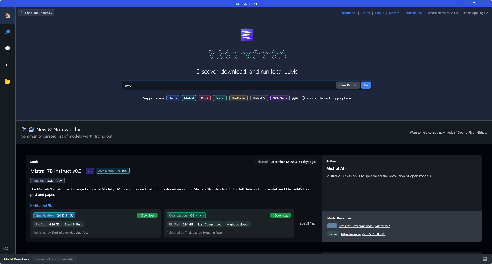
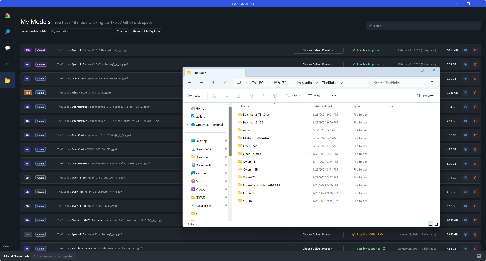
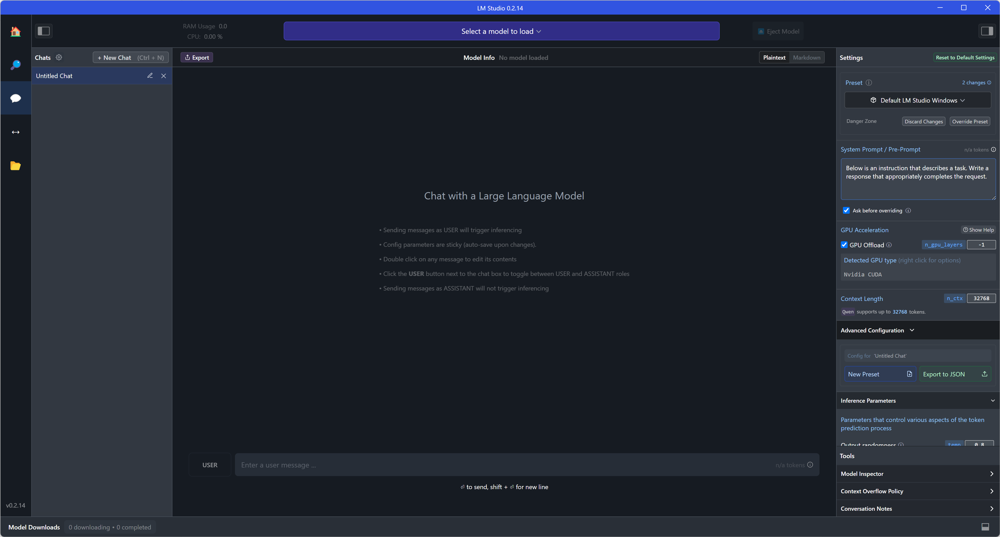
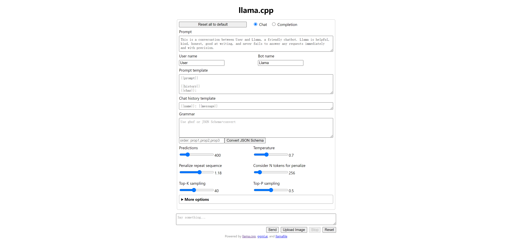
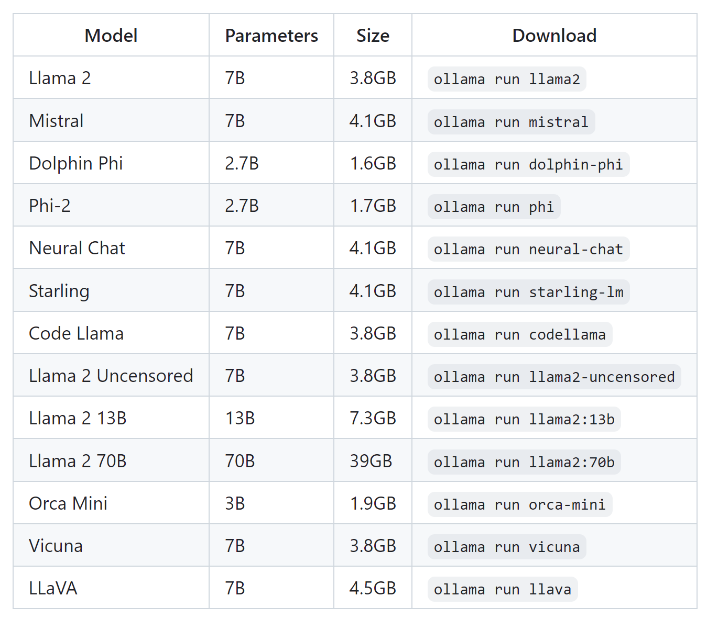
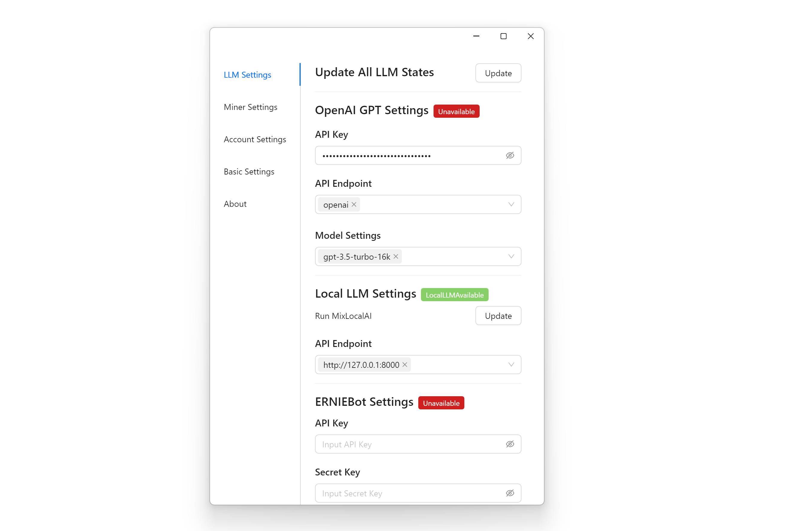
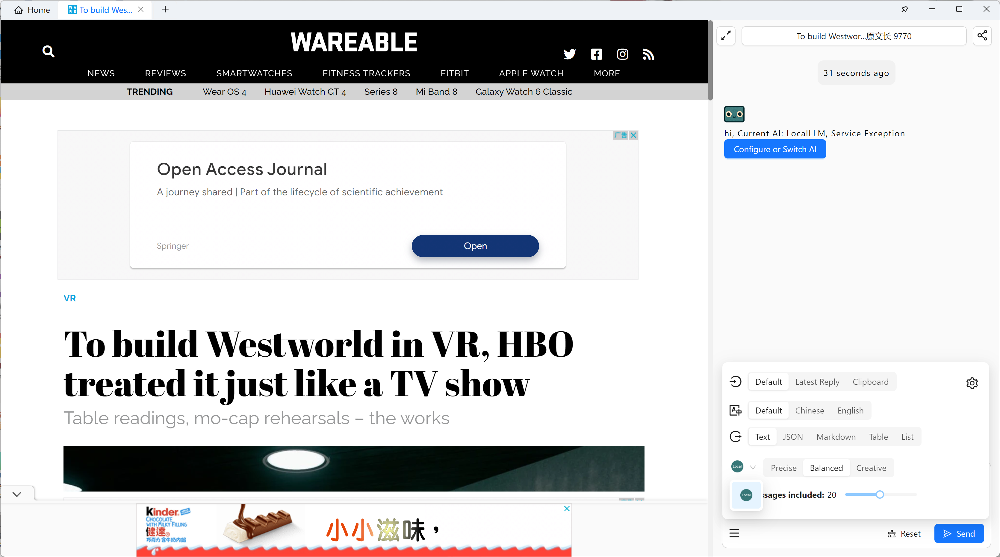
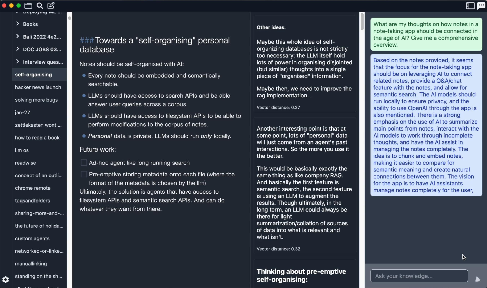
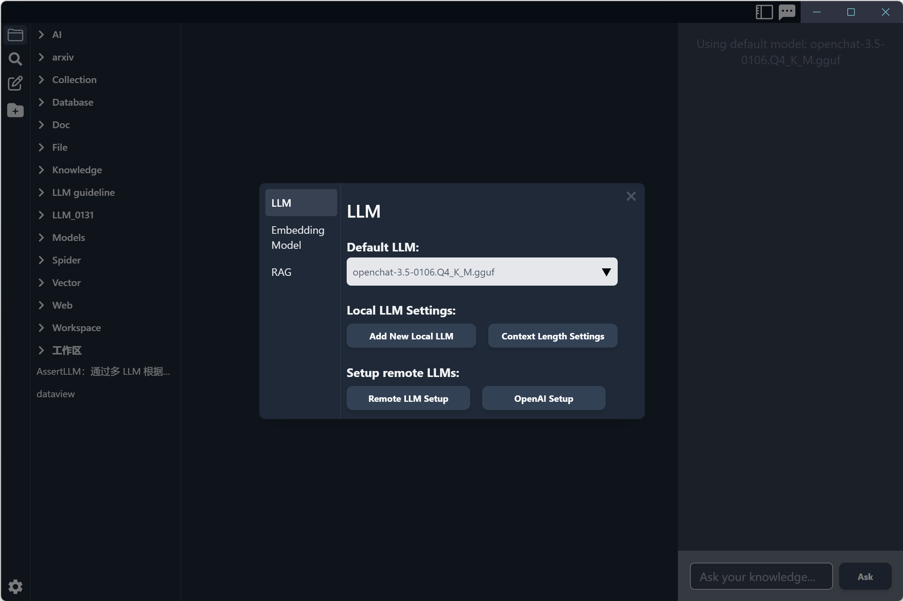
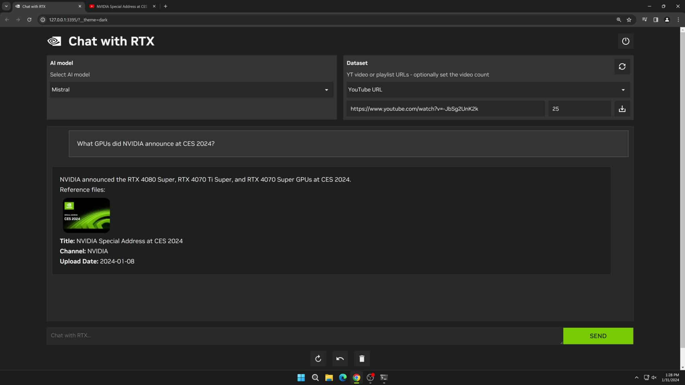

[English](README.md) &nbsp;&nbsp; [中文版](README-zh.md)

如果你对本地LLM非常熟悉，欢迎加入我们的讨论！Discord：https://discord.gg/4AQuf2ctav

# 本地LLM使用指南
## 1. 背景介绍

### 1.1 什么是LLMs？
LLMs，即大型语言模型（Large Language Models），是一种基于人工智能和机器学习技术构建的先进模型，旨在理解和生成自然语言文本。这些模型通过分析和学习海量的文本数据，掌握语言的结构、语法、语义和上下文等复杂特性，从而能够执行各种语言相关的任务。LLM的能力包括但不限于文本生成、问答、文本摘要、翻译、情感分析等。

LLMs例如GPT、LLama、Mistral系列等，通过深度学习的技术架构，如Transformer，使得这些模型能够捕捉到文本之间深层次的关联和含义。模型首先在广泛的数据集上进行预训练，学习语言的一般特征和模式，然后可以针对特定的任务或领域进行微调，以提高其在特定应用中的表现。

预训练阶段让LLMs掌握了大量的语言知识和世界知识，而微调阶段则使模型能够在特定任务上达到更高的性能。这种训练方法赋予了LLMs在处理各种语言任务时的灵活性和适应性，能够为用户提供准确、多样化的信息和服务。

### 1.2 LLMs和应用程序的差异

#### 开放性
**LLMs：** 通过深度学习的预训练和微调过程，LLMs掌握了从海量互联网文本中获得的广泛知识，使其能够理解和生成包括文本、图片、音频、视频、3D素材在内的多种内容类型。这种能力让LLM在处理各种主题和知识领域时展现出卓越的多样化信息处理能力。

**应用程序：** 应用程序则是为满足特定需求而设计，如社交互动、新闻获取、电子商务等，其开放性和内容多样性通常不如LLMs。每个应用都围绕其核心功能构建，提供用户界面和体验优化，但用户访问的信息和服务范围受限于应用的设计目的和功能界定。

#### 准确性
**LLMs：** LLMs通过分析和学习海量文本数据，掌握语言的结构、语义和上下文，具备广泛主题和任务的文本生成能力。然而，这些模型的准确性不仅依赖于丰富多样的训练数据和先进的模型架构，还面临着更新滞后和“幻觉”问题的挑战。在处理专业或最新信息时，LLMs可能产生无事实依据的内容，特别是在缺乏足够上下文或信息迅速变化的情况下。因此，在使用这些模型生成的信息进行决策和分析时，建议进行额外的验证，以提高准确性与可靠性。

**应用程序：** 应用程序中的信息准确性高度依赖于内容的策划和管理，这通常涉及专业人员或团队的主动选择和提供。例如，在专业领域如医疗健康、金融投资等应用中，开发者和专家会投入大量资源来确保所提供信息的准确性、可靠性和及时更新。这种方法虽然可以提高特定领域内信息的质量，但同时也意味着用户接触到的信息范围受限于这些专业团队的知识广度和选择。因此，虽然应用程序在特定领域内可能提供高度准确的信息，它们的内容覆盖和视角受到了人为选择和专业领域限制的约束。

#### 可预期性
**LLMs：** LLMs的可预期性较低，因为它们生成的回答可能因训练数据的多样性和模型理解的复杂性而变化。用户可能会在没有明确指示的情况下收到多种可能的答案，或在特定情境下获得意料之外的回应，更差的情况是无法进行下一轮交互。这种不确定性源自于模型的设计和操作机制，尤其是在处理模糊查询或复杂问题时更为明显。

**应用程序：** 应用程序通常提供更高的可预期性，因为它们是为了满足特定的需求和目的而设计，其功能、操作流程和用户界面都旨在提供一致和可预测的用户体验。应用程序通过明确的用户指令和固定的交互逻辑来减少操作过程中的不确定性，使用户能够预见到自己的操作将产生何种结果。

#### 可用性
**LLMs：** LLMs当前存在着大量可用性问题，除了上面提到的幻觉问题，还存在且不限于以下问题：
1. **答非所问：** LLMs在处理复杂或模糊的查询时，有时可能会提供与用户期望不符的答案。这种现象通常是由于模型对问题的理解不足或错误解释查询的意图所致。尽管模型训练涵盖了大量数据，以提高对自然语言的理解能力，但在理解特定上下文或领域特定语言时，仍可能遇到困难。
2. **响应时长：** 用户在与LLMs进行交互时，尤其是在进行复杂的生成任务或处理大量数据请求时，可能会遇到较长的响应时间。这不仅影响用户体验，也限制了LLMs在实时交互场景中的应用。响应时间的延长主要由于模型的计算需求高和服务器负载大。
3. **处理能力的限制：** 尽管LLMs的理论能力很强，但在实际应用中，其处理能力受到硬件资源、算法效率和可用性的制约。例如，大规模并发请求可能导致性能下降，特别是在资源受限的环境中。此外，LLMs在处理长篇文本或需要深入理解的复杂任务时，效率和准确性可能会降低。
4. **自我更新的局限：** LLMs通常在固定的数据集上进行预训练，这意味着它们在训练之后的知识是静态的。尽管可以通过周期性的重新训练来更新模型，但是这种方法可能不足以实时捕捉最新信息或趋势，从而在一定程度上限制了模型在快速变化领域（例如新闻、科技等）的应用效果。

**应用程序：** 由于软件开发和设计领域长期以来的积累与创新，多数应用程序已经达到了高度的用户友好性和稳定性。设计师和开发者能够依托成熟的平台和框架来构建应用，同时，广泛采用的用户体验设计原则确保了应用能够满足用户的需求和期望。此外，通过持续的用户反馈和迭代开发，应用程序能够及时修复Bug，优化性能，从而提高用户满意度和应用的整体可用性。

### 1.3 开源LLMs有哪些优缺点？
#### 优点
1. **灵活性和适配性：** 开源LLMs提供了不同尺寸的模型，使它们能够部署在各种设备上，从小型设备如树莓派和手机，到个人电脑乃至服务器集群。
2. **减少依赖：** 使用开源LLMs可以在一定程度上减少对特定供应商，如OpenAI的依赖。这不仅提高了技术的可访问性，还促进了创新和自主性。
3. **隐私保护：** 开源LLMs允许用户在本地或私有云环境中部署和使用模型，这有助于减少数据泄露的风险，为处理敏感或私有数据的应用提供了更高的安全性。
4. **可定制性：** 开源模型可以根据特定的需求进行微调，使用户能够优化模型以适应特定的任务或数据集，从而提高了模型的效果和准确性。
5. **社区支持：** 开源LLMs通常受益于活跃的开发者和研究社区的支持。这样的社区不仅提供技术支持和共享解决方案，还促进了新功能、优化和应用场景的快速创新。
6. **高透明度：** 开源模型提供了算法和数据处理流程的可见性，使得技术用户和开发者能够审查模型的工作原理。

#### 缺点
1. **基础模型和数据集的限制：** 开源LLMs的性能上下限很大程度上取决于背后的基础模型和数据集。Meta、Mistral等厂商提供的模型虽然强大，但可能不适合所有类型的任务，特别是那些需要高度专业化知识的领域。
2. **资源和技术门槛：** 尽管开源LLMs提供了极大的灵活性，但部署和维护这些模型需要相当的硬件资源和技术专长。对于缺乏这些资源或技术能力的个人或小团队来说，这可能是一个挑战。
3. **缺乏统一标准：** 开源社区中存在多种LLMs，它们可能采用不同的架构、训练数据集和接口。这种多样性虽然促进了创新，但也给用户选择合适模型和工具带来了复杂性。
4. **稳定性问题：** 本地部署的开源模型可能会遇到硬件限制和软件兼容性问题，导致运行不稳定。这种不稳定性可能会影响到模型的可靠性和用户体验。
5. **处理速度问题：** 如果仅使用CPU进行模型推理，尤其是在处理大型模型或复杂任务时，速度可能非常慢。这不仅延长了处理时间，也可能限制模型在实时或要求高响应速度的应用场景中的使用。
6. **输出质量波动与内容生成的可控性：** 开源LLMs在处理特定语言类型或复杂、边缘案例时，可能会遇到输出质量的波动，有时产生不相关或无意义的回答。同时，当需要生成敏感或要求高度准确的内容时，这些模型可能难以精确控制输出的质量和方向，特别是在缺乏细致的监督和定制化微调的情况下，这可能导致输出内容不达标或不满足特定的期望。

### 1.4 线上和本地LLMs的区别
*这里的LLMs特指Llama、Mistral、GLM等开源模型*
#### 可用性
**线上LLMs：** 线上部署的LLMs提供即时访问和高可用性，这得益于SaaS（软件即服务）提供商在云服务器上预配置好的LLM和RAG（检索增强的生成模型）环境。用户无需担心硬件配置或安装过程，可以立即开始使用这些模型进行文本生成、问答等任务。这种部署方式特别适合没有专业技术背景的用户或需要快速部署解决方案的企业。

**本地LLMs：** 本地部署的LLMs要求用户具备一定的技术知识，包括安装、配置和优化模型的能力。LLM的推理性能和速度直接受限于个人或组织的硬件配置，如处理器、内存和存储空间等。此外，虽然本地部署为用户提供了更大的控制空间，但缺少像RAG这样的高级功能封装，用户可能需要自己进行额外的开发工作。

#### 成本
**线上LLMs：** 对个人用户而言，线上LLMs服务的按需计费模式提供了极大的灵活性和入门门槛较低的优势。个人用户可以根据自己的实际需求和使用频率选择合适的服务计划，避免了高昂的初始投资。这对于那些只是偶尔需要使用语言模型进行特定项目或研究的用户尤其有利。然而，如果个人用户频繁使用这些服务进行大量数据处理，成本可能会逐渐累积，特别是当使用高级功能或大规模数据集时。对于那些需要长期、持续使用语言模型服务的个人用户，定期评估总成本是很重要的。

**本地LLMs：** 对于个人用户来说，选择本地部署LLMs意味着需要一次性投资于高性能的计算硬件。尽管这可能增加一些用户的经济成本，但它提供了长期的成本效益，尤其是对于那些有持续高强度使用需求的用户。本地部署避免了重复的服务费用，一旦设备投入使用，除了可能的维护和升级外，额外的运营成本相对较低。此外，个人用户通过本地部署能够获得更大的控制权和自定义能力，这可能对于研究人员或开发者特别有价值。然而，需要注意的是，本地部署也意味着用户必须具备一定的技术能力来配置和维护系统。

#### 隐私性
**线上LLMs：** 当使用线上LLMs时，用户的数据需要传输到云服务器上进行处理，这引发了对数据隐私和安全的考量。虽然许多SaaS提供商采取了强有力的数据保护措施，并承诺保护用户数据不被滥用或泄露，但这一过程仍然需要用户对提供商的数据处理和隐私政策有一定的信任基础。

**本地LLMs：** 相对于线上模型，本地部署的LLMs在隐私保护方面提供了更高级别的安全性，主要因为数据处理在用户的私有设备或内部服务器上完成，无需数据外传。这种部署方式让用户对数据的控制权大大增强，降低了数据泄露的风险。

#### 依赖性和控制权
**线上LLMs：** 使用线上服务，用户依赖服务提供商确保服务的可用性和性能。这种模式简化了使用流程，允许用户专注于模型的应用而非其维护。然而，这也意味着在系统提示、上下文管理及模型响应定制方面，用户的直接控制能力有所限制。尽管线上服务提供一定程度的配置选项，但它们可能不足以满足所有特定需求，特别是在需要高度定制化输出的场景中。

**本地LLMs：** 本地部署的模型让用户享有更高的控制权，包括对数据处理、模型配置和系统安全的管理。用户可以根据需要深度定制系统提示和上下文处理策略，这在特定应用场景下可能非常重要。然而，这种控制权和灵活性的增加伴随着更高的技术要求和可能的初期设置复杂性。尽管本地部署允许高度定制，但它也要求用户具备相应的技术能力来实现这些定制化的解决方案。

#### 透明度
**线上LLMs：** 线上LLMs服务由第三方提供，可能会在模型的工作原理和数据处理方式上给某些用户带来透明度的担忧。服务提供商通常会努力提供模型训练、数据处理和隐私政策等方面的文档，旨在提高透明度。然而，由于商业保密和操作复杂性，用户可能无法获得模型内部机制的完全细节。这要求用户信任服务提供商，并依赖其提供的信息和控制措施来保障数据安全和隐私。

**本地LLMs：** 本地部署的LLMs允许用户直接访问模型，提供了更高程度的透明度。用户可以自行检查、修改和优化模型，从而深入理解其工作原理并根据需求调整其行为。这种直接控制确保了对模型的完全理解和定制能力，特别适合对数据安全、隐私保护有高要求或需遵循特定法规的组织。然而，这也意味着用户需要承担更大的责任，包括维护模型的透明度和确保其符合伦理和法律标准。

#### 离线
**线上LLMs：** 无法使用

**本地LLMs：** 可正常使用
### 1.5 使用线上LLMs存在哪些问题？
在使用线上LLMs时，我们面临着多个层面的挑战，这些问题从个人数据隐私到模型性能与成本，再到内容的完整性以及检索增强的生成模型（RAG）策略的选择和应用，构成了一系列需要用户和服务提供商共同关注的关键问题。

#### 问题1：个人数据隐私
在线上LLMs的使用过程中，个人数据的隐私成为了一个显著的担忧点。用户与LLM的互动，以及上传的文档，都可能被服务提供商收集用于模型的微调和优化。

#### 问题2：模型性能与成本
服务提供商为了平衡成本和性能，可能会使用不同规模的LLM。较小的模型（如7B或13B参数）虽然可以减少计算资源消耗，提高响应速度，但其推理能力可能不足以处理复杂的查询或生成高质量的文本。用户在选择服务时，可能难以获悉所使用的模型规模和性能，导致实际应用中的效果与预期存在差异。这种不透明性可能会影响用户的使用体验和满意度。

#### 问题3：内容完整性
针对长文档的处理，存在一个问题是LLM是否能够完整地获取和理解整个文档内容。由于技术限制，一些服务可能只会处理文档的一部分内容，如仅分析前几百个词。这种处理方式可能会导致LLM遗漏关键信息，从而影响到生成内容的准确性和相关性。用户可能无法了解其提交的内容是否被完整处理，进而对结果的可靠性产生疑问。

#### 问题4：检索增强的生成模型（RAG）策略
RAG的切割方式和回调策略直接影响LLM的效果，特别是在处理需要广泛知识检索的查询时。不同的切割方法和回调策略决定了LLM访问和整合信息的方式，从而影响到最终生成的答案的准确性和完整性。如果这些策略没有恰当选择或优化，LLM可能无法看到或利用相关的信息来生成最佳的回答。用户通常无法控制或知晓这些内部处理细节，这增加了结果不确定性。

## 2. 哪些理论场景适合使用本地开源LLMs？
*此处标注理论场景是因为当前开源LLMs存在较多实际问题，但这些问题将被逐步克服。*

#### 1. 我的业务场景是否存在大容量、高频的数据请求？
如果你每天需都需要分析和处理大量文档，而一篇文档大概需要4000Token，LLM一轮输出400 Token，那么10轮交互下来最少需要5W Token，20篇那就消耗了100W Token；如果需要跟之前的文档进行交叉比较和深度分析，假设库里有1000篇文章，那一天需要消耗10亿Token（前提是没有其他技术的加持）。

**理论场景：** 个人知识库场景、多文档自动分析场景......

#### 2. 我的业务场景是否涉及多重信息加工甚至多任务？
在多任务和多重信息加工领域，涉及到的操作和处理逻辑非常复杂，尤其是在电脑上进行的活动。这些活动不仅仅是简单的执行命令，更多的是涉及到对用户意图的判断、数据之间的传输和交互，以及如何根据当前的上下文来做出响应。这里面涉及到的Token消耗主要是因为这些操作需要大量的计算资源来处理和响应用户的需求。

在这个过程中，每一个步骤所需的系统提示（System Prompt）、上下文对话的逻辑处理等，都需要根据具体情况进行个性化和差异化的设计。这种情况下的“千人千面”，是指系统必须能够根据每个用户的具体需求和上下文来提供定制化的服务。这与基于推荐算法的“千人千面”有着本质的差异。本质上的差异在于：
1. **处理的动态性与静态性：** 多任务和多重信息加工领域的处理是动态的，依赖于当前的上下文和用户的即时需求，而基于推荐算法的处理更多是静态的，依赖于用户的历史数据。
2. **个性化程度：** 虽然两者都追求“千人千面”，但多任务处理更加注重在特定情境下对用户需求的精准响应，推荐算法更多是依据历史数据或者类似用户的数据进行的一般性预测。
3. **交互性：** 多任务处理涉及到与用户的实时交互，而推荐算法则更多是一种单向的内容推送。

*请注意，这个本质的差异决定了本地LLMs是解决多重信息加工甚至多任务的唯一解决办法，但它有可能是一个闭源LLM。*

**理论场景：** 撰写报告场景、依赖操作系统能力的交互场景......

#### 3. 我的业务场景是否涉及到个人隐私或敏感数据？
在探讨目标设定、日记撰写、财务管理、情感交流等个人化领域时，我们不得不面对一个现实问题：这些活动往往涉及到大量的个人数据处理，而这些数据中包含了用户的敏感信息。比如，在进行日记撰写时，用户可能会记录下自己的私密想法和感受；在财务管理过程中，用户需要处理自己的收入、支出等财务信息；情感交流时，用户可能会分享自己的心理状态和情绪体验。这些活动中生成和处理的数据，都属于高度敏感的个人信息，一旦被泄露，可能会给用户造成不可挽回的伤害。在这样的背景下，本地开源LLMs的应用就显得尤为重要和必要。

**理论场景：** 个人目标设定与跟踪场景、私密情感交流场景、日记撰写与情感分析场景......

#### 4. 我的业务场景是否需要低护栏的大模型？
在当前的技术环境中，线上LLM在提供服务的同时，不得不面对各种法律法规和伦理道德的约束。这些约束往往通过增设“护栏”来实施，目的是为了防止模型生成不当内容，如误导信息、侵犯隐私、散播仇恨言论等。然而，这些护栏在一定程度上限制了LLM的功能和知识的完整使用，尤其是在需要较高自由度的应用场景中，如角色扮演、创意写作等。在这些场景下，内容的过滤和限制可能会阻碍创意的发挥和用户体验的深化。

在此背景下，本地部署的LLMs提供了一种解决方案。通过本地部署，用户可以根据自己的需求和责任范围，调整内容过滤的标准，既能规避法律风险，又能保留更高的创意自由度和个性化服务。这种灵活性在某些业务场景中尤为重要，能够为用户提供更加丰富和深入的互动体验。

**理论场景：** 部分领域的咨询场景、角色扮演场景 

## 3. 开箱即用的本地LLMs

得益于Meta、Mistral和众多开发者提供的开源LLMs，以及Llama.cpp这个开源项目，目前我们可以以很低的成本使用开源LLMs，接下来我推荐一些开箱即用的后端和客户端来帮助各位开启本地LLMs之旅。

### 本地LLMs推荐及下载
*我们推荐使用GGUF版本的量化模型，因为它可以在CPU和消费级GPU环境下单独或者混合使用。欢迎分享自己使用过不错的模型给我们*

#### 1. Mixtral-8x7B-Instruct-v0.1
**介绍**：Mixtral 8x7B是一个具有开放权重的高质量稀疏专家模型 （SMoE） 混合。我们推荐使用Q3及以上版本的量化模型。

**官网：** https://mistral.ai/

**模型大小：** 8x7B

**相关语言：** 英文

**上下文长度：** 32K

**适用于：** 适用于NVIDIA 3090/4090及更大显存的PC主机、拥有32GB内存及以上的M1/M2/M3 Mac

**下载地址：**

https://huggingface.co/TheBloke/Mixtral-8x7B-Instruct-v0.1-GGUF/tree/main

https://modelscope.cn/models/limoncc/Mixtral-8x7B-Instruct-v0.1-GGUF/files

#### 2. OpenChat 3.5 0106 
**介绍**：OpenChat在24年1月份的版本，通过 C-RLFT 在Mistral 7B的基础上进行微调，在推理和中英文双语问答上有较好的表现。我们推荐使用Q4及以上量化模型。

**官网：** https://github.com/imoneoi/openchat

**模型大小：** 7B

**相关语言：** 中文、英文

**上下文长度：** 8K

**适用于：** 适用于大部分电脑

**下载地址：**

https://huggingface.co/TheBloke/openchat-3.5-0106-GGUF

https://modelscope.cn/models/fivetwin/openchat-3.5-0106-GGUF/files

#### 3. OpenChat 3.5-16k 
**介绍**：OpenChat在23年12月份的版本，通过 C-RLFT 在Mistral 7B的基础上进行微调，在推理和中英文双语问答上有较好的表现。我们推荐使用Q4及以上量化模型。

**官网：** https://github.com/imoneoi/openchat

**模型大小：** 7B

**相关语言：** 中文、英文

**上下文长度：** 16K

**适用于：** 适用于大部分电脑

**下载地址：**

https://huggingface.co/TheBloke/openchat_3.5-16k-GGUF/tree/main

https://modelscope.cn/models/limoncc/OPENCHAT3.5-16K-GGUF/files

#### 4. Qwen 14B
**介绍**：通义千问-14B（Qwen-14B）是阿里云研发的通义千问大模型系列的140亿参数规模的模型。我们推荐使用Q5及以上量化模型。

**官网：** https://github.com/QwenLM/Qwen

**模型大小：** 14B

**相关语言：** 中文

**上下文长度：** 8K

**适用于：** 适用于NVIDIA 3080/4080及更大显存的PC主机、拥有16GB内存及以上的M1/M2/M3 Mac

**下载地址：**

https://huggingface.co/Xorbits/Qwen-14B-Chat-GGUF

https://modelscope.cn/models/Xorbits/Qwen-14B-Chat-GGUF/summary

#### 5. Qwen 7B
**介绍**：通义千问-7B（Qwen-7B）是阿里云研发的通义千问大模型系列的70亿参数规模的模型。我们推荐使用Q4及以上量化模型。

**官网：** https://github.com/QwenLM/Qwen

**模型大小：** 7B

**相关语言：** 中文

**上下文长度：** 32K

**适用于：** 适用于大部分电脑

**下载地址：**

https://huggingface.co/Xorbits/Qwen-7B-Chat-GGUF

https://modelscope.cn/models/Xorbits/Qwen-7B-Chat-GGUF/summary

### 如何开启本地LLM
#### 1. LM Studio

**介绍**：LM Studio基于LLama.cpp开发了一套友好的用户界面，支持在Windows、Mac和Linux系统上安装和使用，提供了多种语言模型，并且提供了模型搜索、下载和聊天等功能。

**官网及下载地址**：https://lmstudio.ai/

**操作系统：** Windows、Mac、Linux

**相关语言：** 英文

**使用步骤：**
1. 下载并安装软件
2. 在应用内下载模型，如果因网络等情况无法下载，可以选择存放LLM的文件夹后并在文件夹里新建一个名为“TheBloke”的文件夹，然后将下载过的模型放进“TheBloke”文件夹里。

3. 点击”Select a model to load“选择模型即可开启对话模式，也可以根据自己电脑和模型选择对应的“GPU Acceleration”和“Context Length”，重新加载模型。（如果自己的电脑配置一般，建议不勾选”GPU Offload“，以及“Context Length”设置越大，等待时间会越长，更详细的介绍请看指南第四部分）

4. 如果开启服务端模式，加载模型并填写端口（例如8000），点击“Start Server”即可运行。记住，客户端和服务端的通讯必须兼容OpenAI API模式。

**优点：**
1. 整体使用流程对普通用户友好。
2. 可以很方便地切换模型。
3. 可以很方便地选择CPU和GPU的混合程度。
4. 可以很方便地切换Preset。

**注意事项：**
1. 切换模型或者设置参数后一定要记得重新手动加载模型。
2. 服务端模式下，重新更换模型或者设置参数后，有可能需要重启服务端。
3. 暂时不支持开机启动。
4. 暂时不支持自动进入服务端模式。
5. 如果你的系统是Windows/Linux，处理器需要支持AVX2。

#### 2. llamafile

**介绍**：llamafile将 llama.cpp 与 Cosmopolitan Libc 组合成一个框架，将 LLMs 的所有复杂性压缩为在大多数计算机上本地运行的单个文件可执行文件。

**官网：** https://github.com/Mozilla-Ocho/llamafile

**下载地址：** https://github.com/Mozilla-Ocho/llamafile/releases/

**操作系统：** Windows、Mac、Linux

**相关语言：** 英文

**使用步骤：**
1. 下载文件
2. 如果你是macOS或者Linux用户，打开计算机终端，授予计算机执行此新文件的权限`chmod +x llava-v1.5-7b-q4.llamafile`，接着运行该llama文件`./llava-v1.5-7b-q4.llamafile -ngl 9999`。（记住先进入对应的文件夹再输入指令，“llava-v1.5-7b-q4.llamafile”是你下载的文件名字）
3. 如果你是Windows用户，可以在文件末尾添加“.exe”来重命名该文件。
4. 你的浏览器应该自动打开并显示聊天界面。 （如果没有，只需打开浏览器并将其指向 http://127.0.0.1:8080/  
5. 聊天完毕后，返回终端并点击 `Control-C` 关闭 llamafile，或者直接关闭cmd窗口。
6. 另外，开启llamafile后会自动开启服务端模式，在客户端填写 http://127.0.0.1:8080/ 即可通讯。记住，客户端和服务端的通讯必须兼容OpenAI API模式。

**优点：**
1. 下载文件后即可直接使用。
2. 开启应用后直接进入服务端模式。
3. 可以通过命令行方式设置的方式开机启动应用和服务端模式。

**注意事项：**
1. 目前llamafile的一部分功能依赖于CLI（Command Line Interface），更适合拥有编程能力的用户使用。
2. 由于Windows对可执行文件大小有4GB的限制，所以大部分从网上下载的llamafiles无法使用，需要自己重新打包和设置llamafile，详情请看： https://github.com/Mozilla-Ocho/llamafile 。
3. 导入本地已经下载好的模型，需要重新打包另外一个llamafile。
4. 使用过程中更换模型约等于打开另外一个文件，操作起来不怎么方便。
5. 如果你的系统是Windows/Linux，处理器需要支持AVX2。

#### 3. Ollama
**介绍**：Ollama 是一个基于LLama.cpp的轻量级、可扩展的框架，用于在本地构建和运行语言模型。

**官网及下载地址**：https://ollama.com/

**操作系统：** Windows、Mac、Linux

**相关语言：** 英文

**使用步骤：**
1. 下载并打开执行文件
2. 成功安装后会提示在cmd内运行模型，例如`ollama run mistral`（如果没有下载过模型会自动下载模型）。

3. 在cmd中开始对话

**优点：**
1. 支持开机启动。
2. 开启应用后直接进入服务端模式。
3. 可以通过命令行直接下载模型。
4. 可以通过命令行直接切换模型。

**注意事项：**
1. 目前Ollama依赖于CLI（Command Line Interface），更适合拥有编程能力的用户使用。
2. 导入本地已经下载好的模型需要命令行导入，详情请看： https://github.com/ollama/ollama 。
3. 服务端模式跟OpenAI API不一样，需要客户端兼容并选择对应的模型。
4. 如果你的系统是Windows/Linux，处理器需要支持AVX2。

*欢迎分享自己使用过不错的LLM后端给我们*

### 可连接本地LLM的应用推荐
#### 1. MiX Copilot

**介绍**：MiX Copilot 是一款支持OpenAI和本地LLMs的PC客户端，用于自动爬取、整理和分析资料（数据都以Markdown的形式保存到本地，避免隐私泄露），支持多个Chatbot同时对话、浏览网页+使用LLMs、制作LLM工作流（包括定制Prompt、查询网页）等功能。

**官网及下载地址**：https://www.mix-copilot.com/

**操作系统：** Windows、Mac

**相关语言：** 中文、英文

**使用教程：** https://hci-top.notion.site/MiX-Copilot-Tutorial-English-2c95481c5d4c4c818f40bd04c299b7ea

**使用步骤：**
1. 下载并安装软件
2. 进入“设置-LLM设置”，在本地模型设置项填写服务端链接（记住端口号要一致），例如 http://127.0.0.1:8000 ，点击顶部的”更新“按钮，如果红色Tag变成绿色，说明和LLM服务端连接成功。

3. 在顶部Tab点击“+”号，或者在浏览网页时右键点击“展示Chatbot”开启Chatbot。

4. 在对话面板左下角选择本地LLM!

#### 2. Reor

**介绍**：Reor 是一款由人工智能驱动的桌面笔记应用程序：它会自动链接相关想法、回答笔记中的问题并提供语义搜索。所有内容都存储在本地，用户可以使用类似黑曜石的 Markdown 编辑器来编辑笔记。

**官网及下载地址**：https://www.reorproject.org/

**操作系统：** Windows、Mac

**相关语言：** 英文

**使用步骤：**
1. 下载并安装软件。
2. 选择你存放Markdown的文件夹。
3. 在设置页选择你下载好的量化模型（GGUF格式）以及设置上下文长度。

3. 选择你需要的Embedding模型。**注意：** 一部分地区用户可能因为网络问题无法下载Embedding模型，导致应用无法使用。另外，应用中提供的Embedding模型只擅长处理英文，其他语言不一定适用。
4. 设置RAG的返回数量。

#### 3. Chat with RTX

**介绍**：Chat With RTX 是一款**演示**应用程序，可以将自己的内容（文档、笔记、视频或其他数据）与本地LLM进行交互。Chat With RTX集成了检索增强生成 (RAG)、TensorRT-LLM 和 RTX 加速，用户可以查询自定义聊天机器人以快速获得上下文相关的答案。Chat with RTX 支持各种文件格式，包括文本、pdf、doc/docx 和 xml。只需将应用程序指向包含文件的文件夹，它就会在几秒钟内将它们加载到库中。此外，用户可以提供 YouTube 播放列表的网址，应用程序将加载播放列表中视频的转录，然后查询它们涵盖的内容。

**官网及下载地址**：https://www.nvidia.com/en-us/ai-on-rtx/chat-with-rtx-generative-ai/

**操作系统：** Windows

**相关语言：** 英文

**注意事项：**
1. 目前Chat with RTX是一个演示应用程序。
2. 目前Chat with RTX要求NVIDIA GeForce™ RTX 30 或 40 系列 GPU 或 NVIDIA RTX™ Ampere 或 Ada Generation GPU，具有至少 8GB VRAM 和 16GB RAM。
3. 演示应用程序安装包体积高达35GB。

#### 4. 待补充
*目前全球范围内可以兼容本地LLM的客户端极少，欢迎各位推荐或自荐*

## 4. 使用本地LLMs需要注意什么？
#### 1. 如何选择LLM并让其运行速度更快？
#### 2. 当前LLM经常出现的问题有哪些？
#### 3. 目前LLM能做什么？
#### 4. TBD

## TBD
----------------
最后，如果你对本地LLM非常熟悉，欢迎加入我们的讨论！

Github：https://github.com/xue160709/Local-LLM-Interaction-Guideline

Discord：https://discord.gg/4AQuf2ctav

Twitter：https://twitter.com/XueZhirong

微信：xuezhirong233