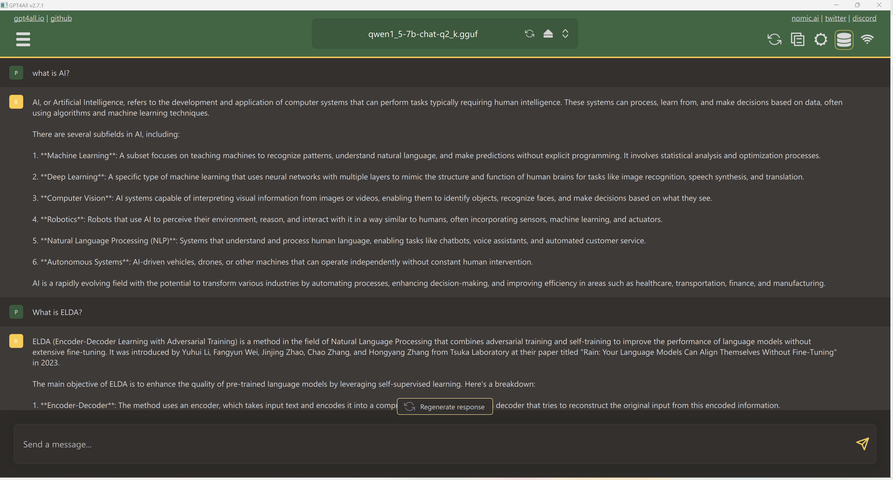
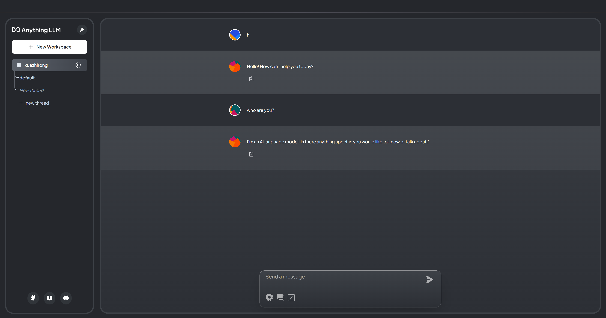
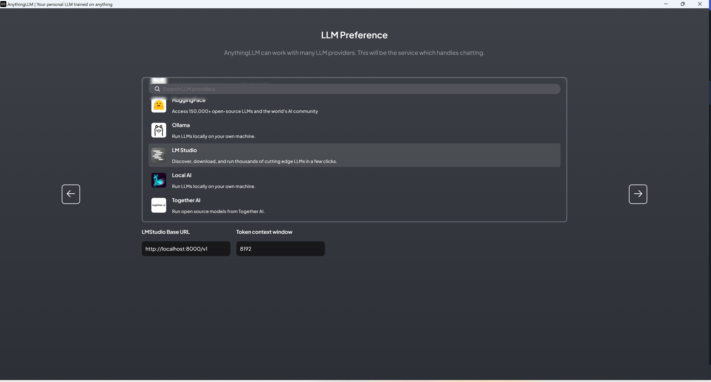
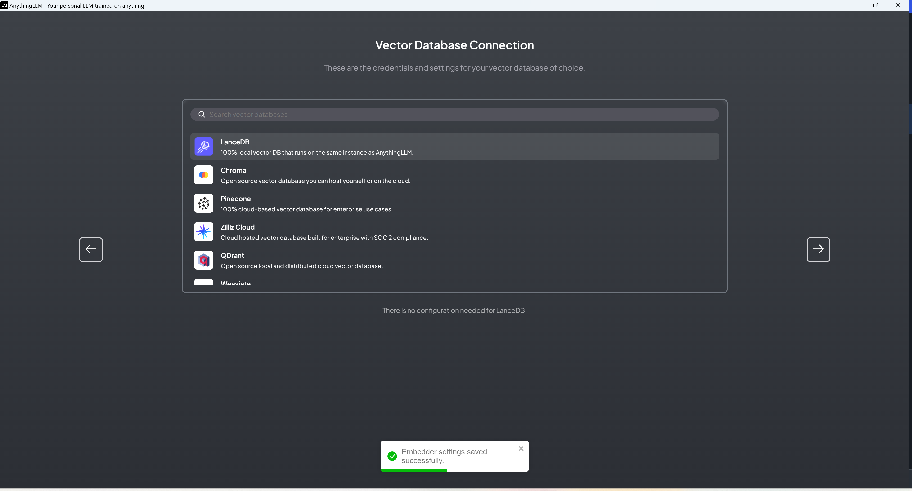
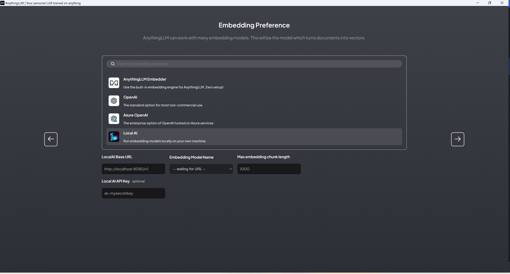
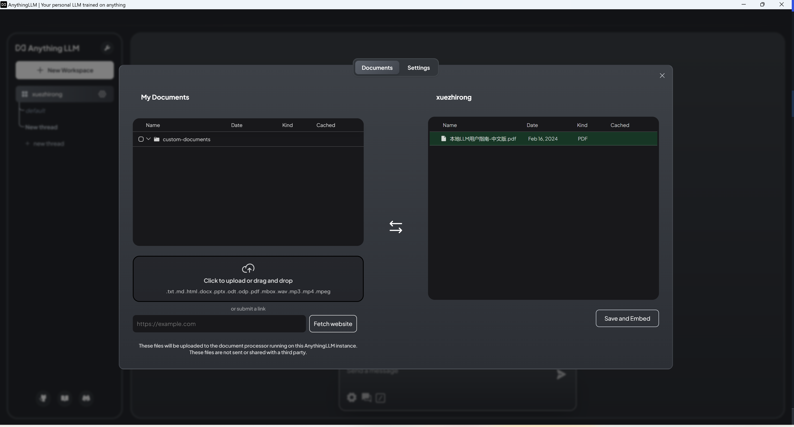

[English](README.md) &nbsp;&nbsp; [中文版](README-zh.md)

If you are very familiar with local LLM, welcome to join our discussion! Discord: https://discord.gg/4AQuf2ctav

### Updated

**2024-3-03**: Version 0.3 adds an introduction to commonly used terms.

**2024-2-24**: Version 0.2 adds an introduction to the Gemma and Llava models, an introduction to the GPT4ALL software, and an introduction to LLM selection.

**2024-2-17**: Version 0.1.

# Local LLM User Guide 0.3
## 1. Background  
  
### 1.1 What are LLMs?  
LLMs, or Large Language Models, are advanced models built based on artificial intelligence and machine learning techniques to understand and generate natural language text. These models are able to perform a variety of language-related tasks by analyzing and learning from massive amounts of textual data and mastering the complex properties of language such as structure, syntax, semantics, and context. The capabilities of LLMs include, but are not limited to, text generation, question and answer, text summarization, translation, and sentiment analysis.  
  
LLMs such as GPT, LLama, Mistral series, etc., enable these models to capture the deeper associations and meanings between texts by means of technical architectures for deep learning, such as Transformer. The models are first pre-trained on a wide range of datasets to learn the general features and patterns of the language, and can then be fine-tuned for specific tasks or domains to improve their performance in particular applications.  
  
The pre-training phase equips the LLMs with a large amount of linguistic and world knowledge, while the fine-tuning phase enables the models to achieve higher performance on specific tasks. This training approach gives LLMs the flexibility and adaptability to handle a wide range of linguistic tasks, enabling them to provide accurate and diverse information and services to users.  
  
### 1.2 Differences between LLMs and applications  
  
#### Openness  
**LLMs:** Through a process of deep learning pre-training and fine-tuning, LLMs acquire extensive knowledge gained from massive amounts of Internet text, enabling them to understand and generate a wide range of content types, including text, images, audio, video, and 3D material. This ability allows LLMs to demonstrate superior diverse information processing capabilities when dealing with a variety of topics and knowledge domains.  
  
**Applications:** Applications, on the other hand, are designed to meet specific needs, such as social interaction, news access, e-commerce, etc., and are typically less open and diverse in content than LLMs. each application is built around its core functionality, providing a user interface and experience optimization, but the range of information and services that the user accesses is limited by the purpose for which the application was designed and the functionality for which it was defined.  
  
#### Accuracy  
**LLMs:** LLMs are capable of generating text on a wide range of topics and tasks by analyzing and learning from massive textual data, and mastering the structure, semantics, and context of language. However, the accuracy of these models not only relies on rich and diverse training data and advanced model architectures, but also faces the challenges of update lag and \"illusion\" problems. When dealing with specialized or up-to-date information, LLMs may produce unsubstantiated content, especially when there is a lack of sufficient context or when the information is rapidly changing. Therefore, when using information generated by these models for decision-making and analysis, additional validation is recommended to improve accuracy and reliability.  
  
**Applications:** The accuracy of information in applications is highly dependent on the curation and management of content, which often involves the active selection and provision of specialized individuals or teams. For example, in specialized domains such as healthcare and financial investment apps, developers and specialists invest significant resources to ensure that the information provided is accurate, reliable, and up-to-date. While this approach improves the quality of information within a specific domain, it also means that the scope of information that users are exposed to is limited by the breadth of knowledge and choices made by these specialized teams. As a result, while applications may provide highly accurate information within a given domain, their content coverage and perspective is constrained by human choice and the limitations of specialized domains.  
  
#### Predictability  
**LLMs:** LLMs are less predictable because the answers they generate may vary depending on the diversity of the training data and the complexity of the model's understanding. Users may receive multiple possible answers without explicit instructions, or unexpected responses in a given context, or worse, fail to proceed to the next round of interaction. This uncertainty stems from the design and operational mechanisms of the model, and is especially evident when dealing with fuzzy queries or complex problems.  
  
**Applications:** Applications typically provide a higher degree of predictability because they are designed to meet specific needs and purposes, and their functionality, operational flow, and user interface are designed to provide a consistent and predictable user experience. Applications reduce uncertainty during operation through explicit user instructions and fixed interaction logic, allowing users to anticipate what their actions will result in.  
  
#### Availability  
**LLMs:** LLMs currently have a large number of usability issues, including and not limited to the following, in addition to the phantom issues mentioned above:  
1. **Answer to the wrong question:** LLMs, when dealing with complex or ambiguous queries, may sometimes provide answers that do not match the user's expectations. This phenomenon is usually due to the model's insufficient understanding of the question or misinterpretation of the intent of the query. Although model training covers a large amount of data to improve understanding of natural language, difficulties may still be encountered in understanding context-specific or domain-specific language.  
2. **Response time:** Users may encounter long response times when interacting with LLMs, especially when performing complex generative tasks or processing a large number of data requests. This not only affects user experience but also limits the application of LLMs in real-time interaction scenarios. The prolonged response time is mainly due to the high computational demands of the model and the high server load.  
3. **Processing capacity constraints:** Despite the theoretical capabilities of LLMs, in practice, their processing capacity is constrained by hardware resources, algorithmic efficiency and availability. For example, large-scale concurrent requests may lead to performance degradation, especially in resource-constrained environments. In addition, LLMs may be less efficient and accurate when processing long texts or complex tasks that require deeper understanding.  
4. **Limitations of self-updating:** LLMs are usually pre-trained on fixed datasets, which means that their knowledge after training is static. Although it is possible to update the model by periodic re-training, this approach may not be sufficient to capture the latest information or trends in real-time, thus limiting to some extent the effectiveness of the model's application in fast-changing domains (e.g., news, technology, etc.).  
  
**Applications:** Thanks to a long history of accumulation and innovation in the field of software development and design, most applications have achieved a high degree of user-friendliness and stability. Designers and developers are able to build applications relying on proven platforms and frameworks, while widely adopted user experience design principles ensure that applications meet users' needs and expectations. In addition, through continuous user feedback and iterative development, apps are able to fix bugs and optimize performance in a timely manner, thus improving user satisfaction and overall app usability.  
  
### 1.3 What are the advantages and disadvantages of open source LLMs?  
#### Advantages  
1. **Flexibility and adaptability:** Open source LLMs provide models of different sizes, enabling them to be deployed on a wide range of devices, from small devices such as Raspberry Pi's and cell phones, to personal computers and even server clusters.  
2. **Reducing dependencies:** The use of open source LLMs can reduce dependency on specific vendors, such as OpenAI, to some extent. This not only increases the accessibility of the technology, but also promotes innovation and autonomy.  
3. **Privacy protection:** Open source LLMs allow users to deploy and use models in local or private cloud environments, which helps to minimize the risk of data leakage and provides a higher level of security for applications that handle sensitive or private data.  
4. **Customizability:** Open-source models can be fine-tuned to meet specific needs, enabling users to optimize the model for a particular task or data set, thus improving its effectiveness and accuracy.  
5. **Community support:** Open source LLMs often benefit from the support of an active developer and research community. Such communities not only provide technical support and shared solutions, but also facilitate rapid innovation of new features, optimizations and application scenarios.  
6. **High Transparency:** The open source model provides visibility into the algorithms and data processing flows, enabling technical users and developers to review how the model works.  
  
#### Disadvantages  
1. **Limitations of underlying models and datasets:** The upper and lower limits of performance of open source LLMs depend heavily on the underlying models and datasets behind them.The models provided by vendors such as Meta, Mistral, etc., while powerful, may not be suitable for all types of tasks, especially in those areas that require highly specialized knowledge.  
2. **Resource and technical thresholds:** While open source LLMs offer great flexibility, deploying and maintaining these models requires considerable hardware resources and technical expertise. This can be a challenge for individuals or small teams that lack these resources or technical skills.  
3. **Lack of harmonized standards:** There is a wide variety of LLMs in the open source community, which may use different architectures, training datasets and interfaces. While this diversity fosters innovation, it also creates complexity for users to select appropriate models and tools.  
4. **Stability issues:** Locally deployed open-source models may encounter hardware limitations and software compatibility issues, resulting in unstable operation. This instability may affect the reliability of the model and the user experience.  
5. **Processing speed issues:** Model inference can be very slow when using only the CPU, especially when processing large models or complex tasks. This not only extends the processing time, but may also limit the use of the model in real-time or application scenarios that require high responsiveness.  
6. **Output quality fluctuations and controllability of content generation:** Open-source LLMs may experience fluctuations in the quality of output when dealing with specific language types or complex, borderline cases, sometimes generating irrelevant or meaningless responses. At the same time, when sensitive or demanding highly accurate content needs to be generated, these models may have difficulty in precisely controlling the quality and direction of the output, especially in the absence of careful supervision and customized fine-tuning, which may result in substandard output content or failure to meet specific expectations.  
  
  
### 1.4 Differences between on-line and local LLMs  
*LLLMs in this context refers specifically to open source models such as Llama, Mistral, GLM, etc.*  
#### Availability  
**Online LLMs:** On-line deployed LLMs provide instant access and high availability thanks to the pre-configured LLM and RAG (Retrieval Augmented Generative Model) environments on cloud servers by SaaS (Software as a Service) providers. Users don't have to worry about hardware configuration or installation process and can start using these models immediately for text generation, Q&A and other tasks. This deployment method is particularly suitable for users without specialized technical backgrounds or for organizations that need to deploy solutions quickly.  
  
**Local LLMs:** Locally deployed LLMs require a certain level of technical knowledge on the part of the user, including the ability to install, configure, and optimize the model.The inference performance and speed of LLMs is directly limited by an individual's or an organization's hardware configurations, such as processor, memory, and storage space. Additionally, while local deployment provides users with greater control, it lacks the encapsulation of advanced functionality like RAG and users may need to perform additional development work on their own.  
  
#### Cost  
**Online LLMs:** For individual users, the on-demand billing model of the online LLMs service offers great flexibility and the advantage of a lower entry barrier. Individual users can choose the appropriate service plan according to their actual needs and frequency of use, avoiding a high initial investment. This is especially beneficial for users who only occasionally need to use the language model for specific projects or research. However, if individual users frequently use these services for large amounts of data processing, the costs may accumulate gradually, especially when using advanced features or large-scale datasets. For those individual users who need to use language modeling services on a long-term, ongoing basis, it is important to periodically evaluate the total cost.  
  
**Local LLMs:** For individual users, choosing to deploy LLMs locally means a one-time investment in high-performance computing hardware. While this may increase the financial cost for some users, it provides long-term cost-effectiveness, especially for those with sustained high-intensity usage requirements. Local deployment avoids duplicate service costs, and once the equipment is in use, the additional operating costs are relatively low, except for possible maintenance and upgrades. In addition, individual users are able to gain greater control and customization through local deployment, which may be particularly valuable to researchers or developers. However, it is important to note that local deployment also means that users must have some technical skills to configure and maintain the system.  
  
  
#### Privacy  
**Online LLMs:** When using online LLMs, user data needs to be transferred to a cloud server for processing, which triggers considerations of data privacy and security. While many SaaS providers adopt strong data protection measures and promise to protect user data from misuse or disclosure, the process still requires a foundation of user trust in the provider's data handling and privacy policies.  
  
**Local LLMs:** Compared to the online model, locally deployed LLMs provide a higher level of security in terms of privacy protection, mainly because data processing is done on the user's private devices or internal servers, eliminating the need for data to be outsourced. This deployment method gives the user much more control over the data and reduces the risk of data leakage.  
  
#### Dependence and control  
**Online LLMs:** Using online services, users rely on the service provider to ensure the availability and performance of the service. This model simplifies the usage process by allowing the user to focus on the application of the model rather than its maintenance. However, it also means that the user's direct control is limited in terms of system prompting, context management, and model response customization. While online services offer some degree of configuration options, they may not be sufficient to meet all specific needs, especially in scenarios that require highly customized output.  
  
**Local LLMs:** Locally deployed models allow users to enjoy a higher level of control, including management of data processing, model configuration and system security. Users can deeply customize system prompts and contextual processing policies as needed, which can be important in specific application scenarios. However, this increased control and flexibility comes with higher technical requirements and possible initial setup complexity. While local deployment allows for a high degree of customization, it also requires users to have the appropriate technical skills to implement these customized solutions.  
  
#### Transparency  
**Online LLMs:** Online LLMs services are provided by third parties and may raise transparency concerns for some users in terms of how the models work and how the data is processed. Service providers typically strive to provide documentation on model training, data processing, and privacy policies, among other things, with the intent of increasing transparency. However, due to commercial confidentiality and operational complexity, users may not have access to full details of a model's internal mechanisms. This requires users to trust the service provider and rely on the information and controls it provides for data security and privacy.  
  
**Local LLMs:** Locally deployed LLMs provide a higher degree of transparency by allowing users direct access to the model. Users can inspect, modify and optimize the models themselves, thereby gaining a deeper understanding of how they work and adapting their behavior to their needs. This direct control ensures complete understanding of the model and the ability to customize it, and is particularly suited to organizations that have high requirements for data security, privacy protection, or need to comply with specific regulations. However, it also means greater responsibility on the part of the user, including maintaining the transparency of the model and ensuring its compliance with ethical and legal standards.  
  
#### Offline  
**Online LLMs:** Unavailable  
  
**Local LLMs:** It works 
### 1.5 What are the problems with using online LLMs?  
When using online LLMs, we face challenges on multiple levels, and these issues, ranging from personal data privacy to model performance and cost to content integrity and the selection and application of retrieval-enhanced generative modeling (RAG) strategies, constitute a set of critical issues that require the joint attention of users and service providers.  
  
#### Question 1: Personal data privacy  
The privacy of personal data becomes a significant point of concern during the use of online LLMs. Users' interactions with LLMs, as well as uploaded documents, may be collected by service providers for model fine-tuning and optimization.  
  
#### Question 2: Model performance and cost
Service providers may use LLMs of different sizes in order to balance cost and performance. smaller models (e.g., 7B or 13B parameters), while reducing computational resource consumption and improving response speed, may not have sufficient inference power to handle complex queries or generate high-quality text. It may be difficult for users to be informed of the size and performance of the model used when choosing a service, leading to discrepancies between the results and expectations in real-world applications. This opacity may affect users' experience and satisfaction.  
  
#### Issue 3: Content integrity  
For processing long documents, there is a question of whether LLM is able to capture and understand the entire document content in its entirety. Due to technical limitations, some services may only process a part of the document, e.g., analyzing only the first few hundred words. This processing may cause the LLM to miss key information, which affects the accuracy and relevance of the generated content. Users may not be able to know whether their submission has been processed in its entirety, which in turn raises questions about the reliability of the results.  
  
#### Problem 4: Retrieval of an enhanced generative model (RAG) strategy  
The cutting methods and callback strategies of RAGs directly affect the effectiveness of LLMs, especially when dealing with queries that require extensive knowledge retrieval. Different cutting methods and callback strategies determine the way LLM accesses and integrates information, which in turn affects the accuracy and completeness of the final generated answer. If these strategies are not properly selected or optimized, the LLM may not be able to see or utilize the relevant information to generate the best answer. Users typically have no control over or knowledge of these internal processing details, which increases outcome uncertainty.  
  
## 2. Which theoretical scenarios are suitable for using native open source LLMs?  
* The theoretical scenarios are labeled here because there are more practical problems with current open source LLMs, but these problems will be gradually overcome. *  
  
#### 1. Does my business scenario have high volume, high frequency data requests?  
If you need to analyze and process a large number of documents every day, and a document requires about 4000 Token, LLM output 400 Token a round, then 10 rounds of interaction down to at least 5W Token, 20 that consumes 100W Token; if you need to cross-comparison and in-depth analysis of previous documents, assuming that there is a library of 1000 articles, that One day needs to consume 1 billion Token (provided that there is no other technology to add).  
  
**Theoretical Scenarios:** Personal Knowledge Base Scenario, Multi-Document Automated Analysis Scenario ......  
  
#### 2. Does my business scenario involve multiple information processing or even multi-tasking?  
In the area of multitasking and multiple information processing, there is a great deal of complexity in the operations and processing logic involved, especially for activities performed on a computer. These activities are more than simply executing commands; they involve judging the user's intent, transferring and interacting between data, and how to respond based on the current context. The Token consumption involved here is mainly due to the fact that these operations require a lot of computational resources to process and respond to the user's needs.  
  
In this process, the system prompts required at each step, the logical handling of contextual dialogues, etc., need to be personalized and differentiated according to the specific situation. In this case, \"thousand faces\" means that the system must be able to provide customized services according to the specific needs and context of each user. This is fundamentally different from a \"thousand faces\" based on recommendation algorithms. The essential difference is:  
1. **Dynamic versus static processing:** Processing in the area of multitasking and multiple information processing is dynamic, relying on the current context and the immediate needs of the user, whereas processing based on recommendation algorithms is more static, relying on the user's historical data.  
2.** Degree of personalization:** Although both pursue \"thousands of people, thousands of faces\", multitasking is more focused on the precise response to user needs in a specific context, and recommendation algorithms are more based on historical data or general predictions based on the data of similar users.  
3. **Interactivity:** Multitasking involves real-time interaction with the user, whereas recommendation algorithms are more of a one-way content push.  
  
* Note that this essential difference dictates that native LLMs are the only solution to multiple information processing or even multitasking, but it is possible that it is a closed-source LLM.  
  
**Theoretical scenarios:** report writing scenarios, interaction scenarios dependent on operating system capabilities ......  
  
#### 3. Does my business scenario involve personal privacy or sensitive data?  
When exploring personalization domains such as goal setting, diary writing, financial management, emotional communication, etc., we have to face a real problem: these activities often involve the processing of a large amount of personal data, which contains sensitive information about the user. For example, in diary writing, users may record their private thoughts and feelings; in financial management, users need to process their income, expenditure and other financial information; in emotional communication, users may share their psychological state and emotional experience. The data generated and processed in these activities are highly sensitive personal information, which, once leaked, may cause irreparable harm to users. In such a context, the application of local open source LLMs becomes particularly important and necessary.  
  
**Theoretical Scenarios:** Personal Goal Setting and Tracking Scenarios, Private Emotional Communication Scenarios, Journal Writing and Emotional Analysis Scenarios ......  
  
#### 4. Does my business scenario require a large model with low guardrails?  
In the current technological environment, online LLMs have to face various legal, regulatory and ethical constraints while providing services. These constraints are often enforced by adding \"guardrails\" to prevent models from generating inappropriate content, such as misleading information, invasion of privacy, and hate speech. However, these guardrails limit the functionality of LLMs and the complete use of knowledge to a certain extent, especially in application scenarios that require a high degree of freedom, such as role-playing, creative writing, etc. In these scenarios, content filtering can be used to prevent the model from generating inappropriate content. In these scenarios, content filtering and restriction may hinder creativity and deepen the user experience.  
  
In this context, locally deployed LLMs offer a solution. With local deployment, users can adjust the criteria for content filtering according to their needs and scope of responsibility, avoiding legal risks while retaining a higher degree of creative freedom and personalized service. This flexibility is particularly important in certain business scenarios, providing users with a richer and deeper interactive experience.  
  
**Theoretical Scenarios:** Counseling Scenarios, Role Play Scenarios in Selected Areas  
  
## 3. Out-of-the-box native LLMs  
  
Thanks to the open source LLMs provided by Meta, Mistral and many other developers, as well as the open source project Llama.cpp, we can now use open source LLMs at a very low cost, and I'd like to recommend some out-of-the-box backends and clients to help you start your journey with local LLMs.  
  
### Local LLMs recommended and downloaded  
*We recommend using the GGUF version of the quantization model as it can be used alone or in a mix of CPU and consumer GPU environments. Feel free to share with us models that you have used well*.  

#### 1. Qwen1.5-32B

**Introduction:** Qwen1.5-32B is a 32 billion parameter scale model of the Tongyi Qianwen large model series developed by Aliyun. We recommend using Q2 and above quantitative models.

**Official website:** [https://github.com/QwenLM/Qwen1.5](https://github.com/QwenLM/Qwen1.5)

**Model size:** 32B

**Related languages:** English, Chinese

**Context length:** 32K

**Applicable to:** Computers with NVIDIA of 24GB VRAM or above, M1/M2/M3 Macs with 32GB of RAM or above

**Downloaded at:**

https://huggingface.co/Qwen/Qwen1.5-32B-Chat-GGUF

https://modelscope.cn/models/qwen/Qwen1.5-32B-Chat-GGUF/summary

#### 2. Qwen1.5-14B  
**Introduction:** Qwen1.5-14B is a 14 billion parameter scale model of the Tongyi Qianwen large model series developed by Aliyun. We recommend using Q2 and above quantitative models.  
  
**Official website:** https://github.com/QwenLM/Qwen1.5
  
**Model size:** 14B  
  
**Related languages:** English, Chinese  
  
**Context length:** 32K  
  
**Applicable to:** Computers with NVIDIA of 12GB VRAM or above, M1/M2/M3 Macs with 16GB of RAM or above
  
**Downloaded at:**  

https://huggingface.co/Qwen/Qwen1.5-14B-Chat-GGUF

https://modelscope.cn/models/qwen/Qwen1.5-14B-Chat-GGUF/summary

  
#### 3. Qwen1.5-7B  
**Introduction:** Qwen1.5-7B is a 7 billion parameter scale model of the Tongyi Qianwen large model series developed by Aliyun. We recommend using Q2 and above quantitative models.  
  
**Official website:** https://github.com/QwenLM/Qwen1.5
  
**Model size:** 7B  
  
**Related languages:** English, Chinese  
  
**Context length:** 32K  
  
**Applicable to:** It is suitable for most computers, but it is recommended for computers with NVIDIA graphics cards of 12GB of video memory and above, and M1/M2/M3 Macs with 16GB of memory and above.  
  
**Downloaded at:**  

https://huggingface.co/Qwen/Qwen1.5-7B-Chat-GGUF

https://modelscope.cn/models/qwen/Qwen1.5-7B-Chat-GGUF/summary

#### 4. Mixtral-8x7B-Instruct-v0.1  
**Introduction:** Mixtral 8x7B is a high quality Sparse Model of Expertise (SMoE) blend with open weights. We recommend using the Q3 and higher versions of the quantization model.  
  
**Official website:** https://mistral.ai/  
  
**Model size:** 8x7B  
  
**Related languages:** Multi-language  
  
**Context length:** 32K  
  
**Applicable to:** Computers with NVIDIA of 24GB VRAM or above, M1/M2/M3 Macs with 32GB of RAM or above 
  
**Downloaded at:**  
  
https://huggingface.co/TheBloke/Mixtral-8x7B-Instruct-v0.1-GGUF/tree/main  
  
https://modelscope.cn/models/limoncc/Mixtral-8x7B-Instruct-v0.1-GGUF/files  

#### 5. OpenChat 3.5 0106  
**Introduction:** OpenChat's January '24 release, fine-tuned from Mistral 7B via C-RLFT, has better performance in inference and bilingual English/Chinese Q&A. We recommend using Q4 and above quantitative models.  
  
**Official website:** https://github.com/imoneoi/openchat  
  
**Model size:** 7B  
  
**Related languages:** Chinese, English  
  
**Context length:** 8K  
  
**Applicable to:** It is suitable for most computers, but it is recommended for computers with NVIDIA graphics cards of 12GB of video memory and above, and M1/M2/M3 Macs with 16GB of memory and above.
  
**Downloaded at:**  
  
https://huggingface.co/TheBloke/openchat-3.5-0106-GGUF  
  
https://modelscope.cn/models/fivetwin/openchat-3.5-0106-GGUF/files  
  
#### 6. OpenChat 3.5-16k  
**Introduction:** OpenChat's December '23 release, fine-tuned from Mistral 7B via C-RLFT, has better performance in inference and bilingual English/Chinese Q&A. We recommend using Q4 and above quantitative models.  
  
**Official website:** https://github.com/imoneoi/openchat  
  
**Model size:** 7B  
  
**Related languages:** Chinese, English  
  
**Context length:** 16K  
  
**Applicable to:** It is suitable for most computers, but it is recommended for computers with NVIDIA graphics cards of 12GB of video memory and above, and M1/M2/M3 Macs with 16GB of memory and above.  
  
**Downloaded at:**  
  
https://huggingface.co/TheBloke/openchat_3.5-16k-GGUF/tree/main  
  
https://modelscope.cn/models/limoncc/OPENCHAT3.5-16K-GGUF/files  

#### 7. llava 1.6  
**Introduction:** LLaVA is a multimodal model for chatbots with computer vision and natural processing capabilities that can analyze images and provide feedback with text.  
  
**Model size:** 7B  
  
**Related languages:** English  
  
**Context length:** 32K  
  
**Applicable to:** It is suitable for most computers, but it is recommended for computers with NVIDIA graphics cards of 12GB of video memory and above, and M1/M2/M3 Macs with 16GB of memory and above.  
  
**Downloaded at:**  
  
https://huggingface.co/cmp-nct/llava-1.6-gguf/

https://modelscope.cn/models/mirror013/llava-1.6-mistral-7b-gguf/summary

#### 8. Gemma-7b-it  
**Introduction:** Gemma is a family of lightweight, state-of-the-art open models from Google, built from the same research and technology used to create the Gemini models. They are text-to-text, decoder-only large language models, available in English, with open weights, pre-trained variants, and instruction-tuned variants.
  
**Official website:** https://huggingface.co/google/gemma-7b-it 
  
**Model size:** 7B  
  
**Related languages:** Multi-language  
  
**Context length:** 8K  
  
**Applicable to:** It is suitable for most computers, but it is recommended for computers with NVIDIA graphics cards of 12GB of video memory and above, and M1/M2/M3 Macs with 16GB of memory and above.  

**Note:** There will be bugs when using quantitative models below Q8 on llama.cpp.
  
**Downloaded at:**  
  
https://huggingface.co/sayhan/gemma-7b-it-GGUF-quantized

https://modelscope.cn/models/fivetwin/gemma-7b-it-gguf/summary

#### 9. Gemma-2b-it  
**Introduction:** Gemma is a family of lightweight, state-of-the-art open models from Google, built from the same research and technology used to create the Gemini models. They are text-to-text, decoder-only large language models, available in English, with open weights, pre-trained variants, and instruction-tuned variants. 
  
**Official website:** https://huggingface.co/google/gemma-2b-it
  
**Model size:** 2B  
  
**Related languages:** Multi-language
  
**Context length:** 8K  
  
**Applicable to:** It is suitable for most computers. 

**Note:** There will be bugs when using quantitative models below Q8 on llama.cpp.
  
**Downloaded at:**  
  
https://huggingface.co/lmstudio-ai/gemma-2b-it-GGUF

https://modelscope.cn/models/CruiseTian/gemma-2b-gguf-quantized/summary
  
  
### How to use local LLM  
#### 1. LM Studio  
  
  
**Introduction**: LM Studio develops a set of friendly user interfaces based on LLama.cpp, supports installation and use on Windows, Mac and Linux systems, provides models in multiple languages, and offers features such as model search, download and chat.  
  
**Official website and download url**: https://lmstudio.ai/  
  
**Operating systems:** Windows, Mac, Linux  
  
**Related languages:** English  
  
**Steps for use:**  
1. Download and install the software.  
2. Download the model in the application, if you can't download the model due to network or other circumstances, you can select the folder where the LLM is stored and create a new folder named \"TheBloke\" in the folder, then put the downloaded model into the \"TheBloke\" folder. Then put the downloaded models into \"TheBloke\" folder.  
  
3. Click \"Select a model to load\" to select a model to open the dialog mode, you can also select the corresponding \"GPU Acceleration\" and \"Context Length\" according to your own computer and model to reload the model. \"Context Length\" according to your computer and model to reload the model. (If your computer configuration is average, it is recommended to uncheck \"GPU Offload\", and the larger the \"Context Length\" setting, the longer the waiting time will be, please refer to the fourth part of the guide for a more detailed introduction.)  
  
4. If server-side mode is enabled, load the model and fill in the port (e.g. 8000) and click \"Start Server\" to run. Remember that client-server communication must be compatible with OpenAI API mode.  
  
  
**Advantage:**  
1. The overall use process is friendly to the average user.  
2. Models can be easily switched.  
3. The degree of mixing of CPU and GPU can be easily selected.  
4. Preset can be easily switched.  
5. Compatible with multi-modal models, images can be queried directly in the interface.
  
**Note:**  
1. Always remember to reload the model manually after switching models or setting parameters.  
2. In server-side mode, it may be necessary to restart the server after changing models or setting parameters.  
3. Booting is not supported for the time being.  
4. Automatic entry into server-side mode is not supported for the time being.  
5. If your system is Windows/Linux, the processor needs to support AVX2.  
  
#### 2. llamafile  
  
  
**Introduction**: llamafile combines llama.cpp with Cosmopolitan Libc into a framework that compresses all the complexity of LLMs into a single file executable that runs locally on most computers.  
  
**Official website:** https://github.com/Mozilla-Ocho/llamafile  
  
**Downloaded at:** https://github.com/Mozilla-Ocho/llamafile/releases/  
  
**Operating systems:** Windows, Mac, Linux  
  
**Related languages:** English  
  
**Steps for use:**  
1. Downloading file.  
2. If you are a macOS or Linux user, open a computer terminal and grant the computer permission to execute this new file `chmod +x llava-v1.5-7b-q4.llamafile`, then run the llama file `. /llava-v1.5-7b-q4.llamafile -ngl 9999`. (Remember to enter the corresponding folder before typing the command, \"llava-v1.5-7b-q4.llamafile\" is the name of the file you downloaded)  
3. If you are a Windows user, you can rename the file by adding \".exe\" to the end of the file.  
4. Your browser should automatically open and display the chat screen. (If not, just open your browser and point it to http://127.0.0.1:8080/)  
5. When you have finished chatting, go back to your terminal and click `Control-C` to close llamafile, or just close the cmd window.  
6. In addition, when you turn on llamafile, server-side mode is automatically enabled, so you can communicate with the client by filling in http://127.0.0.1:8080/. Remember that client-server communication must be compatible with OpenAI API mode.  
  
**Advantage:**  
1. Download the file and use it directly.  
2. Directly enter server-side mode after opening the application.  
3. You can start the application and server mode at boot time by setting it from the command line.  
  
**Note:**  
1. Currently part of llamafile's functionality relies on CLI (Command Line Interface), which is more suitable for users with programming skills.  
2. Since Windows has a 4GB limit on the size of executable files, most llamafiles downloaded from the Internet cannot be used, and you need to repackage and reset the llamafile yourself, for details, please see: https://github.com/Mozilla-Ocho/llamafile .  
3. Importing a model that has been downloaded locally requires repackaging another llamafile.  
4. Changing the model during use is equivalent to opening another file, which is not very convenient to operate.  
5. If your system is Windows/Linux, the processor needs to support AVX2.  

#### 3. GPT4All

**Introduction**: A free-to-use, locally running, privacy-aware chatbot that requires no GPU or internet.

**Official website and download url**: https://gpt4all.io/

**Operating System:** Windows, Mac, Linux

**Related languages:** English

**Steps for use:**
1. Download and install the software.
2. Select the model storage path.
3. Download LLMs and RAG models (if there are models in the model storage path, you can use them directly).
4. Select the model at the top of the application to start the conversation.
5. If you need to turn on the Server mode, just click the Wifi icon, but the port cannot be viewed or modified. The port in Server mode is 4891, and the complete URL is: http://127.0.0.1:4891.

**Advantage:**  
1. Support RAG function.
2. You can choose the degree of mixing of CPU and GPU.

**Precautions:**
1. The port (4891) in Server mode cannot be viewed and modified within the application.
2. GPT4All may not be compatible with the complete OpenAI API mode, and some clients cannot receive data.
3. It does not support startup at the moment.
4. Automatically entering server mode is not supported for the time being.
5. Automatic selection of RAG’s local folder is not supported for the time being.
6. If your system is Windows/Linux, the processor needs to support AVX2.
7. The user experience needs to be improved.
  
#### 4. Ollama  
**Introduction**: Ollama is a lightweight, extensible framework based on LLama.cpp for building and running language models locally.  
  
**Official website and download url**: https://ollama.com/  
  
**Operating system:** Windows, Mac, Linux  
  
**Related languages:** English  
  
**Steps for use:**  
1. Download and open the implementation file.  
2. After successful installation you will be prompted to run the model within cmd, e.g. `ollama run mistral` (if you have not downloaded the model it will be downloaded automatically).  
  
  
3. Start a dialog in cmd  
  
**Advantage:**  
1. Support for boot-up.  
2. Directly enter server-side mode after opening the application.  
3. Models can be downloaded directly from the command line.  
4. Models can be switched directly from the command line.  
  
**Note:**  
1. Currently Ollama relies on CLI (Command Line Interface), which is more suitable for users with programming skills.  
2. Importing a model that has been downloaded locally requires a command line import, see https://github.com/ollama/ollama for details.  
3. The server-side model is not the same as the OpenAI API, which requires the client to be compatible and select the corresponding model.  
4. If your system is Windows/Linux, the processor needs to support AVX2.  
  
*Feel free to share your own good LLM backends with us  
  
### Recommendations for applications that can connect to the local LLM  
#### 1. MiX Copilot  
  
  
**Introduction**: MiX Copilot is a PC client that supports OpenAI and local LLMs for automatically crawling, organizing and analyzing information (data are saved locally as Markdown to avoid privacy leakage), supporting multiple Chatbot conversations at the same time, browsing web pages + using LLMs, making LLM workflows (including customized Prompt, querying web pages) and other functions.  
  
**Official website and download url**: https://www.mix-copilot.com/  
  
**Operating systems:** Windows, Mac  
  
**Related languages:** Chinese, English  
  
**Tutorial on use:** https://hci-top.notion.site/MiX-Copilot-Tutorial-English-2c95481c5d4c4c818f40bd04c299b7ea  
  
**Steps for use:**  
1. Download and install the software  
2. Go to \"Settings - LLM Settings\", fill in the server link in the Local Model Settings item (remember the port number should be the same), for example, http://127.0.0.1:8000, and click the \"Update\" button at the top, if the red If the red tag turns green, it means the connection with LLM server is successful.  
  
3. Enable Chatbot by clicking the \"+\" sign in the top Tab or right clicking \"Show Chatbot\" while browsing the web.  
  
4. Select Local LLM in the lower left corner of the dialog panel!  
  

#### 2. AnythingLLM for Desktop

**Introduction**: AnythingLLM can be used for unlimited documents, completely private, can use GPT-4, custom models or open source models such as Llama, Mistral, etc., and supports multiple formats such as PDF, Word documents, etc.

**Official website and download url**: https://useanything.com/

**Operating System:** Windows, Mac

**Related languages:** English

**Steps for use:**
1. Download and install the software.
2. Set up the model (you can set up OpenAI API, connect to LM-Studio, etc.), Embedding, and vector database respectively.

3. Set up your workspace.
4. Start a conversation.
5. You can add MD, PDF, MP4 and other files in the client, or directly add the website URL.
6. Add the above document to the workspace to start Embedding and have a conversation.

#### 3.Reor

**Introduction**: Reor is a desktop note-taking app powered by artificial intelligence: it automatically links related ideas, answers questions in notes, and provides semantic search. All content is stored locally, and users can edit notes using a Markdown editor like Obsidian.

**Official website and download url**: https://www.reorproject.org/

**Operating System:** Windows, Mac

**Related languages:** English

**Steps for use:**
1. Download and install the software.
2. Select the folder where you store Markdown.
3. On the settings page, select the quantization model you downloaded (GGUF format) and set the context length.

3. Select the Embedding model you need. **Note:** Users in some areas may be unable to download the Embedding model due to network problems, resulting in the application becoming unusable. In addition, the Embedding model provided in the application is only good at processing English and may not be applicable to other languages.
4. Set the return quantity of RAG.
  
#### 4. Chat with RTX  
  
**Introduction**:Chat With RTX is a **demo** application that allows you to interact your own content (documents, notes, videos, or other data) with native LLM.Chat With RTX integrates Retrieval Augmented Generation (RAG), TensorRT-LLM, and RTX Acceleration, which allows users to query a custom chatbot to quickly get Chat with RTX supports a variety of file formats including text, pdf, doc/docx, and xml. simply point the application to the folder containing the files and it will load them into the library in seconds. Additionally, users can provide the URL of a YouTube playlist and the application will load transcriptions of the videos in the playlist and then look up what they cover.  
  
**Official website and download url**: https://www.nvidia.com/en-us/ai-on-rtx/chat-with-rtx-generative-ai/  
  
**Operating system:** Windows  
  
**Related languages:** English  
  
**Note:**  
1. Currently Chat with RTX is a demo application.  
2. Currently Chat with RTX requires NVIDIA GeForce™ RTX 30 or 40 series GPUs or NVIDIA RTX™ Ampere or Ada Generation GPUs with at least 8GB of VRAM and 16GB of RAM.  
3. The size of the demo application installation package is up to 35GB.  
  
#### 5. To be added  
*There are very few native LLM-compatible clients in the world, so we welcome your recommendations or self-recommendations.  

## 4. What should you pay attention to when using local LLMs?
#### 1. First you need to know the following points:
1. LLMs of different training sizes will make errors, even GPT-5.
2. LLM with different training scales determines its own inference level. For example, the 13B LLM model is better than the 2B LLM model, but the quality of tasks completed by the small model can be improved through fine-tuning.
3. After the LLM model is quantized, the smaller the volume, the worse the accuracy will be. For example, Q2 < Q8.
4. Currently, the best devices for running LLM are NVIDIA GPUs or M1 and above Macs. If your computer has an AMD or Intel GPU, you can currently only use the CPU to run LLM.
5. It is fastest to load all LLM models into the GPU and run them.

#### 2. How to make LLM run efficiently?
1. **8G and below GPU**: 2B-LLM + 4-8k Token or 7B-LLM + 2-4k Token.
2. **8-12GB GPU**: 7B-LLM + 4k-6k Token or 14B-LLM + 2-4k Token.
3. **12-24GB GPU-**: 7B-LLM + 8-12k Token or 14B-LLM + 4-8k Token.

Note: The final LLM model volume + the video memory occupied by the context < GPU video memory, otherwise the speed will be slower (for example, an 8k context will occupy 6~10G of video memory). You can choose different quantization models according to your needs to reduce the volume of the LLM model. 
#### 3. What do Q, S, K and arrays in the model represent?
#### 4. What are the common problems currently occurring in LLM?
#### 5. What can LLM do currently?
#### 6. How to use RAG locally?
#### 7. Is local RAG currently available?

## 5. Common professional terms
#### System Prompt
**Explanation:** In the context of Large Language Models (LLM), a system prompt refers to the initial text or instructions given by the model to guide or initialize the behavior of the model. This hint usually contains the information or context needed for the model to perform a specific task. For example, in a chatbot application, system prompts may be a fixed series of questions or instructions that activate the model to start a conversation flow.

**Note:** Although end users typically do not set system prompts directly, understanding its concept helps understand the starting point for interacting with language models. For developers, carefully designing system prompts when designing interactive applications or tasks can greatly improve the efficiency and accuracy of model execution tasks.

#### User Prompt
**Explanation:** A User Prompt is user-entered text designed to guide or request a language model to perform a specific response or action. For example, users might answer the system's questions or ask their own questions directly.

**Note:** Users should be as clear and specific as possible when providing prompts so that the language model can more accurately understand the intent and give relevant answers.

####Assistant
**Explanation:** In the context of LLM, "assistant" generally refers to an application or service built on a large language model that is able to understand a user's query or instruction and generate a human-readable natural language response . Such assistants can perform a variety of functions, including answering questions, providing advice, performing specific tasks, and more. In short, an assistant is a tool or service that applies language model technology to achieve human-computer interaction.

**Note:** Users do not need to care about the complex configuration of the backend when interacting with an LLM-based assistant, but understanding how the assistant works can help interact with it more effectively. For example, clear, specific instructions or queries can help the assistant understand the intent more accurately and provide relevant answers or services. Users should also understand that while assistants can provide help and information, their answers may be limited by training data and the limitations of current technology.

#### Token
**Explanation:** Token is the basic unit when the language model processes text. It can be a word, a character or a part of the text. Language models understand and generate text based on tokens.

**User Settings Note:** Users typically do not interact directly with tokens, but should be aware that the length and complexity of text may be affected by the model's processing capabilities (i.e. token limitations).

#### Context Length
**Explanation:** Context length refers to the maximum length of text (in tokens) that the language model can consider when generating a response. Text longer than this length will be ignored.

**Note:** When interacting with the language model, users should try to simplify their input and avoid exceeding the context length limit of the model to ensure that important information can be considered by the model.

#### Temperature

**Explanation:** Temperature is a parameter that controls the diversity of text generated by the language model. The higher the temperature value, the more random and diverse the text generated; the lower the temperature value, the more the text tends to be common or predictive expressions.

**Note:** Users can adjust the temperature value as needed for more creative or precise answers. Be aware, however, that too high a temperature may cause responses to be off-topic or irrelevant.

#### Top K

**Explanation:** Top K is a text generation strategy that restricts the language model to only select the next word from the K options with the highest probability at each generation step.

**Note:** Adjusting the value of Top K can affect the diversity and accuracy of answers. Smaller K values may make the generated text too regular, while larger K values may increase text diversity but reduce accuracy.

#### Top P

**Explanation:** Top P (also known as kernel sampling) is a text generation strategy that selects the smallest set of words with a cumulative probability exceeding P, and then randomly selects the next word from this set.

**Note:** Adjusting the value of Top P can balance the innovativeness and relevance of your answers. Similar to Top K, choosing an appropriate P value is important to generate a balance between quality and diversity.

#### Min P

**Explanation:** Min P is a threshold set when using the Top P sampling strategy to filter out words with a probability lower than a certain value P to reduce the chance of generating low-probability words.

**Note:** Setting a Min P value can help reduce the risk of generating irrelevant or meaningless content. By adjusting this value, the user can control the quality and consistency of the language model output.

#### Repeat Penalty

**Explanation:** The repetition penalty is a mechanism to prevent the language model from repeating the same word or phrase. When repeated generation is detected, the generation probability of these words or phrases will be penalized to reduce their probability of being selected again.

**Note:** By adjusting the size of the repetition penalty, the user can control the variety and novelty of the generated text. Appropriate penalties help improve the readability and information richness of text.
  
## TBD  
----------------  
Finally, if you are very familiar with local LLM, welcome to join our discussion!
  
Github:  https://github.com/xue160709/Local-LLM-User-Guideline  
  
Discord:  https://discord.gg/4AQuf2ctav

Twitter:  https://twitter.com/XueZhirong  
